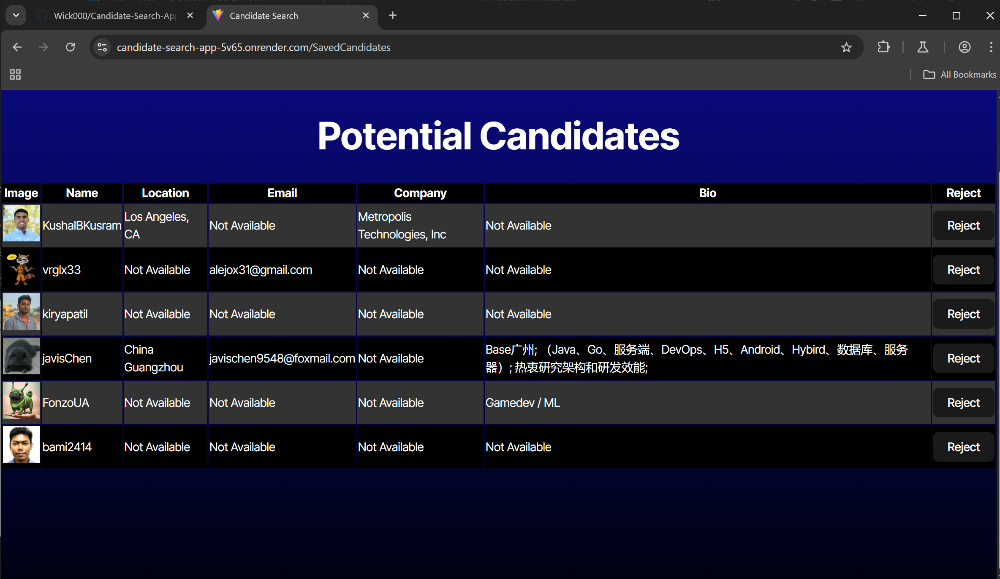

# Candidate Search Application


## Description

A website to search through random github candidates and either  save them to a table or skip over them.

## Table of Contents

- [Installation](#installation)
- [Usage](#usage)
- [License](#license)
- [Link](#link)
- [Screenshot](#screenshot)
- [Questions](#questions)

## Installation

Run the following command to install dependencies:

```
npm i to install dependencies.
```

## Usage

Visit the site to use the app!


## License

This project is licensed under the MIT license. For more information, see [this link](https://opensource.org/licenses/MIT).

## Link

[Click here for render website!](https://candidate-search-app-5v65.onrender.com)

## Screenshot




## Questions

If you have any questions, feel free to reach out to me at [wick9872000@yahoo.com](mailto:wick9872000@yahoo.com). You can also find me on GitHub at [Wick000](https://github.com/Wick000).
